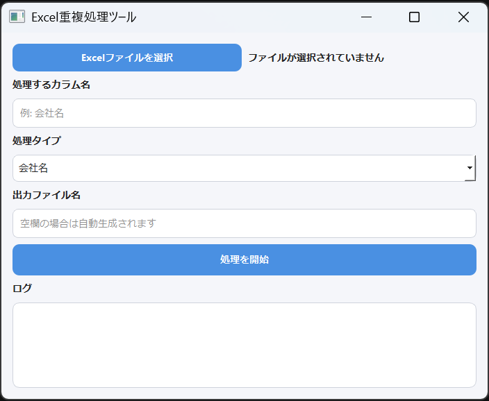

# Excel重複データ削除ツール

## 概要

このツールは、Excelファイル内の重複データを自動的に削除するためのデスクトップアプリです。

指定したカラムを基準に重複チェックを行い、最初の1件のみを残して、重複行全体を削除します。

Python + PyQt5 で作成されており、exe化して他のPCでもそのまま利用可能です。


---

# 主な機能

- Excelファイル選択
- 任意カラム名指定
- 重複削除ルール選択
- 出力ファイル名指定
- ログ表示（色付き）
- exeファイル対応

---

# 対応している処理タイプ

## 1. 会社名

以下の処理を行ってから重複判定します。

- 全角 → 半角変換
- 小文字化
- 前後空白削除
- `/` 以降の文字削除

### 例

| 元データ | 判定結果 |
|---|---|
| ＡＢＣ株式会社 | abc株式会社 |
| ABC株式会社/東京支店 | abc株式会社 |

---

## 2. URL

URLのドメイン部分のみを比較します。

### 例

以下は同じURLとして扱われます。

```text
http://abc.com
http://abc.com/about
https://www.abc.com/contact
```
→ 判定対象: abc.com

---

# 使用方法

## 1. Excelファイルを選択

「Excelファイル選択」ボタンをクリックします。

## 2. カラム名入力

例:
```text
会社名
企業名
URL
```

## 3. 処理タイプ選択

- 会社名
- URL

## 4. 出力ファイル名入力（任意）

未入力の場合:
```text
元ファイル名_done.xlsx
```

が自動生成されます。

## 5. 実行

「処理開始」ボタンを押してください。

## ログ色説明

|色	|意味|
|---|---|
|黒	|通常メッセージ|
|緑	|成功|
|オレンジ	|警告|
|赤	|エラー|

## 必要ライブラリ

```bash
pip install pandas openpyxl pyqt5 pyinstaller
pip install pyqtdarktheme
```

## exeファイル作成方法

```bash
pyinstaller --onefile --windowed --icon=assets/icon.ico main.py
```

生成先:
```text
dist/main.exe
```

## 推奨環境

- Windows 10 / 11
- Python 3.10+

## 注意事項

- Excelファイルを開いたまま実行しないでください
- カラム名は完全一致で入力してください
- 大容量ファイルの場合、処理に時間がかかる場合があります